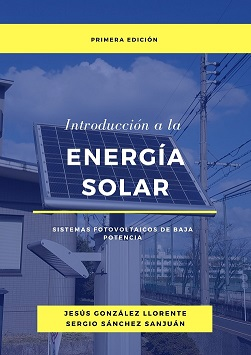

### Books

{::}

- Introduction to Solar Energy [In Spanish]
  - This book describes the basic of solar energy. It is divided into three parts: "Fundamentals of solar energy", "Models and techniques to maximize the energy obtained from the solar panels" and "Design of photovoltaic systems".
    - Read some sample chapters [here](https://libros.jesusgonzalez.co/energ%C3%ADa-solar.html).
    - Buy in Amazon [here](https://www.amazon.com/dp/9584926365)

- Obtaining solar energy and its efficient use in satellites  [In Spanish]
  - It details the components of energy systems for small satellite by focusing on how to use the energy efficiently. It describes the results based on simulation of the models for each component.
    - Read the full text [here](https://repository.usergioarboleda.edu.co/bitstream/handle/11232/652/obtenci%c3%b3n%20energ%c3%ada%20sat%c3%a9lites.pdf?sequence=8&isAllowed=y)

--------------------------------------------------------------------------------
### Journals articles

1. C. Salazar, J. Gonzalez‑Llorente, L. Cardenas, J. Mendez, S. Rincon, J. Rodriguez‑Ferreira, and I. F. Acero, “Cloud Detection Autonomous System Based on Machine Learning and COTS Components On‑Board Small Satellites,” Remote
Sensing, vol. 14, no. 21, 2022, iSSN: 2072‑4292. DOi: 10.3390/rs14215597.
2. J. Gonzalez‑Llorente, A. A. Lidtke, K. Hatanaka, L. Limam, I. Fajardo, and K.‑I. Okuyama, “In‑orbit feasibility demonstration of supercapacitors for space applications,” Acta Astronautica, vol. 174, pp. 294–305, 2020, iSSN: 0094‑5765. DOi: https://doi.org/10.1016/j.actaastro.2020.05.007.
3. L. Limam, K. Hatanaka, J. Gonzalez‑Llorente, T. Chikashi, C. Maeda, and K.‑i. Okuyama, “Space Environment Evaluation Test of Solid‑State‑Ceramic Battery Advanced Energy Storage Under Vacuum and Thermal Vacuum,” International Review of Aerospace Engineering, vol. 13, no. 2, pp. 68–79, 2020. DOi: https://doi.org/10.15866/irease.v13i2.18582.
4. I. Fajardo Tapia, A. A. Lidtke, S. Bendoukha, J. Gonzalez‑Llorente, R. Rodríguez, R. Morales, D. Faizullin, M. Matsuoka, N. Urakami, R. Kawauchi, M. Miyazaki, N. Yamagata, K. Hatanaka, F. Abdullah, J. J. Rojas, M. El‑Hady, K. Cosmas, T. U., P. Saganti, D. Holland, T. Dachev, S. Tuttle, R. Dudziak, and K.‑i. Okuyama, “Design, Implementation, and Operation of a Small Satellite Mission to Explore the Space Weather Effects in Leo,” Aerospace, vol. 6, no. 10, p. 108, 2019. DOi:10.3390/aerospace6100108.
5. J. Gonzalez‑Llorente, A. Lidtke, R. Hurtado, and K. Okuyama, “Single‑bus and Dual‑bus Architectures of Electrical Power Systems for Small Spacecraft,” Journal of Aerospace Technology and Management, vol. 11, no. e4419, 2019. DOi: 10.5028/jatm.v11.1086.
6. J. Gonzalez‑Llorente, A. A. Lidtke, K. Hatanaka, R. Kawauchi, and K.‑I. Okuyama, “Solar Module Integrated Converters as Power Generator in Small Spacecrafts: Design and Verification Approach,” Aerospace, vol. 6, no. 5, p. 61, 2019. DOi:10.3390/aerospace6050061.
7. R. Hurtado‑Velasco and J. Gonzalez‑Llorente, “Simulation of the magnetic field generated by square shape Helmholtz coils,” Applied Mathematical Modelling, vol. 40, no. 23‑24, pp. 9835–9847, 2016, iSSN: 0307904X. DOi: 10.1016/j.apm.2016.06.027.
8. S. Sanchez‑Sanjuan, J. Gonzalez‑Llorente, and R. Hurtado‑Velasco, “Comparison of the Incident Solar Energy and
Battery Storage in a 3U CubeSat Satellite for Different Orientation Scenarios,” Journal of Aerospace Technology and
Management, vol. 8, no. 1, pp. 91–102, 2016. DOi: http://dx.doi.org/10.5028/jatm.v8i1.531.
9. J. Gonzalez‑Llorente and G. Puerto Leguizamon, “Estimación de la cantidad de potencia suministrada por las celdas fotovoltaicas de un cubesat,” Tecnura, vol. 18, no. 41, pp. 53–63, 2014.

#### Research profiles

See list of publication in [Google Scholar](https://scholar.google.com/citations?hl=es&user=pBC8EsoAAAAJ&view_op=list_works&sortby=pubdate){:target="_blank"}\
See list of publication in [Scopus](https://www.scopus.com/authid/detail.uri?authorId=35090267300){:target="_blank"}
